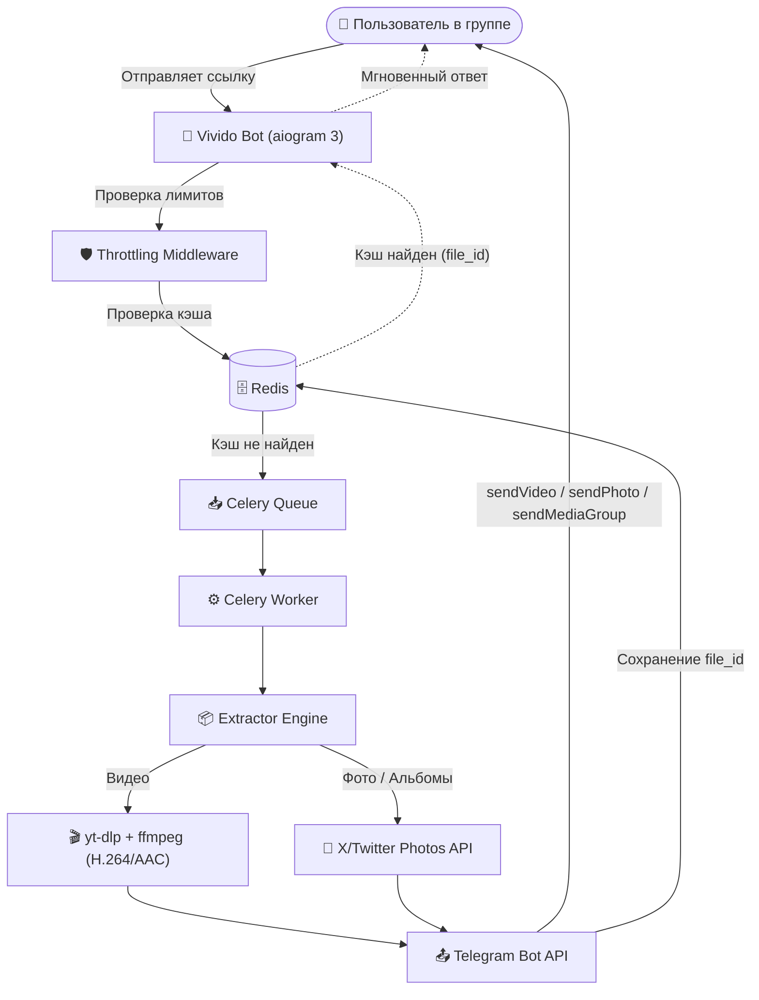

# ⚡ Vivido — Fast Telegram Media Embedder Bot

<p align="center">
  
  
  
  
  
  
  
</p>

**Vivido** — высокопроизводительный асинхронный Telegram-бот для автоматического скачивания, обработки и отправки медиаконтента (видео, фото и галерей) из **TikTok**, **YouTube Shorts** и **X (Twitter)** в групповые чаты.

---

## 🌟 Ключевые возможности

- 🎬 **Широкая поддержка платформ:**
  - **YouTube Shorts:** `youtube.com/shorts/...`, `youtu.be/...`
  - **TikTok:** `tiktok.com/@.../video/...`, `vt.tiktok.com/...`, `vm.tiktok.com/...`
  - **X (Twitter):** видео, одиночные фото и **галереи / альбомы** в оригинальном качестве (`orig`).
- ⚡ **Мгновенная отдача из кэша (Redis):** если медиа уже скачивалось ранее в запрошенном качестве, бот отправляет его за миллисекунды по Telegram `file_id`.
- ⚙️ **Гибкая настройка качества (`/quality` / `/settings`):**
  - Возможность выбора **1080p (Full HD)** или **720p (Быстрее)** индивидуально для каждого чата.
  - Изменение настроек доступно **только администраторам** группы.
- 🍏 **Идеальная совместимость с iOS / iPhone:** видео принудительно упаковываются в контейнер H.264 (`avc1`) + AAC (`mp4a`) с флагом `+faststart` (исключает проблему черного экрана или первого кадра на iPhone).
- 🛡️ **Защита от флуда (Throttling Middleware):** умное ограничение частоты запросов от одного чата на уровне Redis.
- 💬 **Красивое оформление сообщений:**
  - Текст и автор в виде аккуратной цитаты (Telegram quote).
  - Интерактивная инлайн-кнопка перехода к источнику (`🎬 Смотреть на YouTube`, `🎵 Смотреть в TikTok`, `𝕏 Смотреть в X`).
- 🔄 **Динамические статусы чата (Chat Actions):** отображение `«печатает...»`, `«отправляет видео...»` или `«отправляет фото...»` в зависимости от стадии и типа медиа.
- 👥 **Group-Only режим:** бот предназначен для работы в группах. В личных сообщениях бот предлагает кнопку быстрого добавления в группу (`startgroup=true`).

---

## 🏗️ Архитектура системы



---

## 📁 Структура проекта

```
vivido/
├── src/
│   └── vivido/
│       ├── bot/                  # Обработчики команд, коллбэков и сообщений
│       │   ├── __init__.py
│       │   └── handlers.py
│       ├── celery_worker/        # Фоновые задачи Celery
│       │   ├── celery_app.py
│       │   └── tasks.py
│       ├── connector/            # Асинхронный клиент Redis
│       │   └── redis.py
│       ├── core/                 # Конфигурация, регулярные выражения, константы
│       │   ├── config.py
│       │   └── constants.py
│       ├── cookies/              # Cookies для yt-dlp (опционально)
│       │   └── cookies.txt
│       ├── extractor/            # Диспетчер и модули извлечения медиа
│       │   ├── media.py          # Оркестратор
│       │   ├── photo.py          # Модуль скачивания фотографий и галерей
│       │   └── video.py          # Модуль скачивания видео (yt-dlp)
│       ├── keyboards/            # Инлайн-клавиатуры
│       │   └── inline.py
│       ├── logger/               # Настройка логирования (Loguru)
│       │   └── logger.py
│       ├── middlewares/          # Middleware троттлинга запросов
│       │   └── throttling.py
│       ├── schemas/              # Pydantic-схемы данных
│       │   └── media.py
│       └── main.py               # Точка входа в приложение
├── tests/                        # Модульные и интеграционные тесты
│   ├── test_middleware.py
│   ├── test_models.py
│   └── test_regex.py
├── docker-compose.yml            # Спецификация Docker Compose
├── Dockerfile                    # Multi-stage образ бота и воркера
├── pyproject.toml                # Конфигурация проекта и зависимостей uv
└── README.md
```

---

## 🚀 Быстрый старт

### 1. Требования
- **Docker** и **Docker Compose** *(рекомендуется для продакшна)*
- **ИЛИ** Python 3.13+, `ffmpeg`, `uv` и запущенный сервер Redis.

### 2. Клонирование и настройка переменных окружения
Создайте файл `.env` в корне проекта:
```env
BOT_TOKEN=1234567890:ABCdefGhIJKlmNoPQRsTUVwxyZ
REDIS_URL=redis://redis:6379/0
```

> 💡 Для локального запуска без Docker укажите `REDIS_URL=redis://localhost:6379/0`.

### 3. Запуск через Docker Compose (Рекомендуется)

```bash
docker compose up -d --build
```

Проверить статус контейнеров:
```bash
docker compose ps
```

Просмотр логов:
```bash
docker compose logs -f
```

---

## 🛠️ Локальная разработка

1. **Установка менеджера пакетов uv:**
   ```bash
   # Windows (PowerShell)
   powershell -c "irm https://astral.sh/uv/install.ps1 | iex"
   
   # Linux / macOS
   curl -LsSf https://astral.sh/uv/install.sh | sh
   ```

2. **Синхронизация зависимостей:**
   ```bash
   uv sync
   ```

3. **Запуск тестов:**
   ```bash
   uv run pytest
   ```

4. **Локальный запуск сервисов:**
   ```bash
   # Терминал 1 (Бот)
   uv run vivido

   # Терминал 2 (Воркер Celery)
   uv run celery -A vivido.celery_worker.celery_app worker --loglevel=info --concurrency=4
   ```

---

## 🔒 Безопасность

- **Без открытых портов наружу:** Бот взаимодействует с Telegram через защищенный Long-polling канал.
- **Python API вместо shell-команд:** Все вызовы `yt-dlp` происходят через нативный Python API, исключая Command Injection.
- **Защита от SSRF:** Строгая фильтрация ссылок по whitelist доменов (YouTube, TikTok, X).
- **Защита от исчерпания ресурсов:** Лимит размера файлов (50 МБ), запрет плейлистов и гарантированное удаление временных файлов в блоке `finally:`.

---

## 📜 Лицензия

MIT License © 2026 VladMontana
